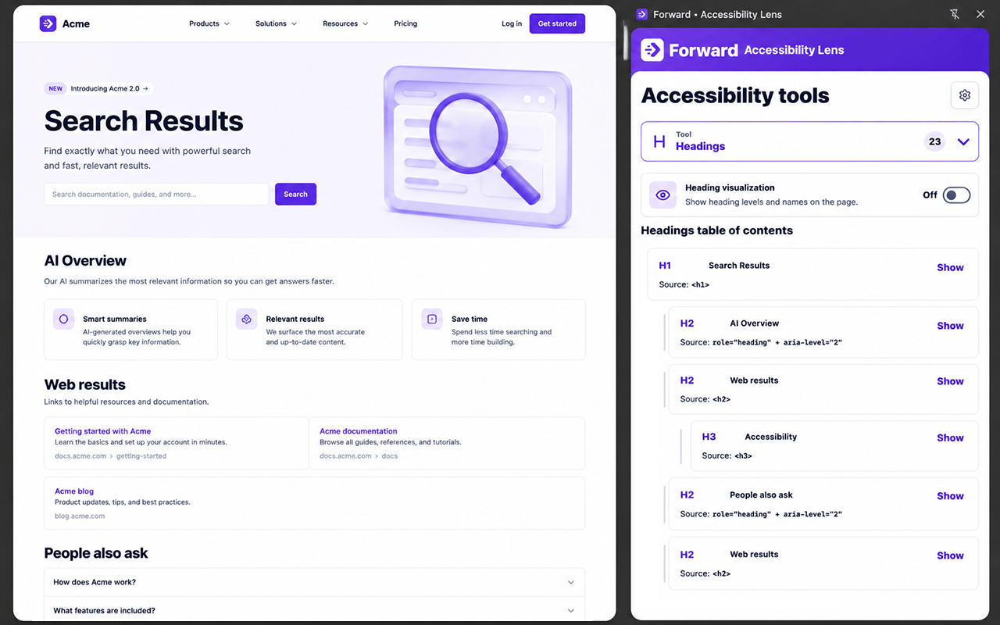

# Forward Accessibility Lens

[](https://github.com/forlaens/forward-accessibility-lens/actions/workflows/ci.yml)
[](LICENSE)

Forward Accessibility Lens is a Chrome side-panel extension for quick, practical accessibility inspection while auditing pages.

[Install from the Chrome Web Store](https://chromewebstore.google.com/detail/forward-%E2%80%A2-accessibility-l/eddnebfaphoibcpcnpiokjjcgnecfgpb) · [Learn more at Forlæns](https://forlaens.com/forward-udvidelser/)



## What It Does

- Shows headings, landmarks, images, ARIA labels, live regions, interactive items, and tables.
- Adds optional on-page visual overlays for structure checks.
- Provides a semantic linear view for reading-order inspection.
- Includes color contrast and text resize tools.
- Supports packaging and release helpers for the Chrome Web Store.

## Development

Install dependencies:

```sh
npm ci
```

Run the test suite:

```sh
npm test
```

Build the extension:

```sh
npm run build:extension
```

For a locally branded build:

```sh
npm run build:local
```

The production extension output is written to `dist/`.

## Chrome Web Store

Release helpers are documented in [CHROME_WEB_STORE_RELEASE.md](CHROME_WEB_STORE_RELEASE.md).

Keep `.env.chrome-webstore` local. Use `.env.chrome-webstore.example` as the template.

## Dependency Updates

Renovate runs every morning from GitHub Actions, after successful CI runs, and can also be started manually from the Renovate workflow. It uses the repository secret `RENOVATE_TOKEN` so it can update package files and GitHub Actions workflows.

Renovate dependency pull requests are automatically merged only after all status checks pass.

## License

Forward Accessibility Lens is available under the [MIT License](LICENSE).
